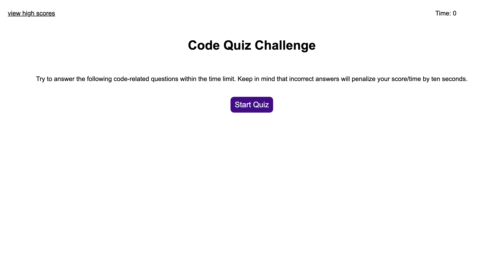
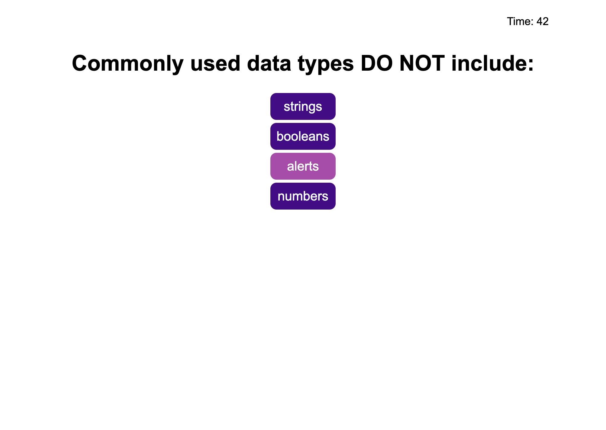
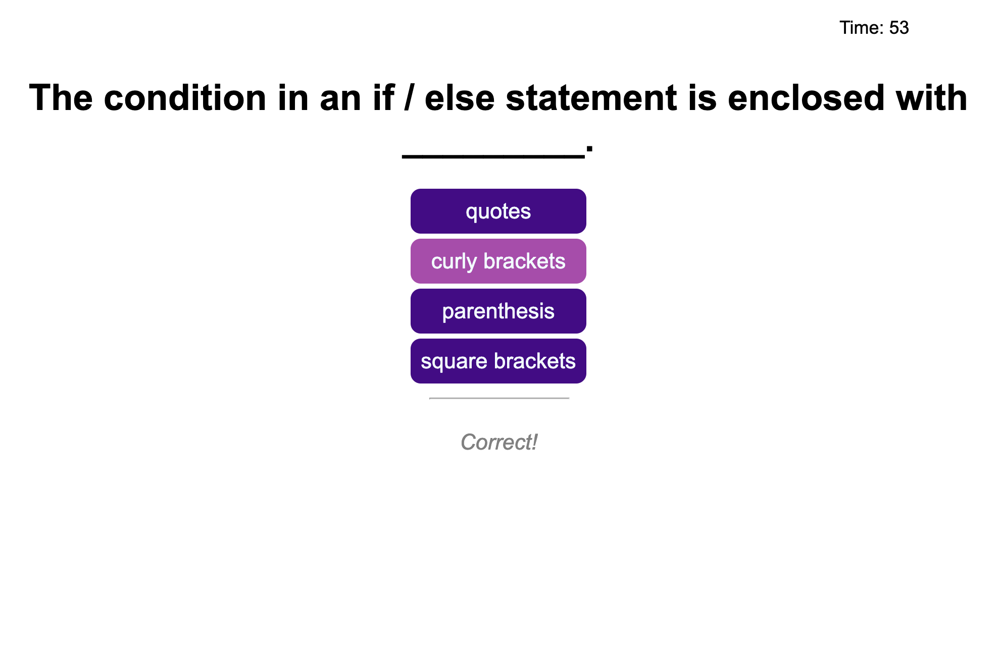
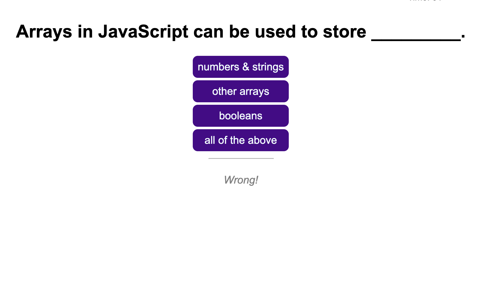
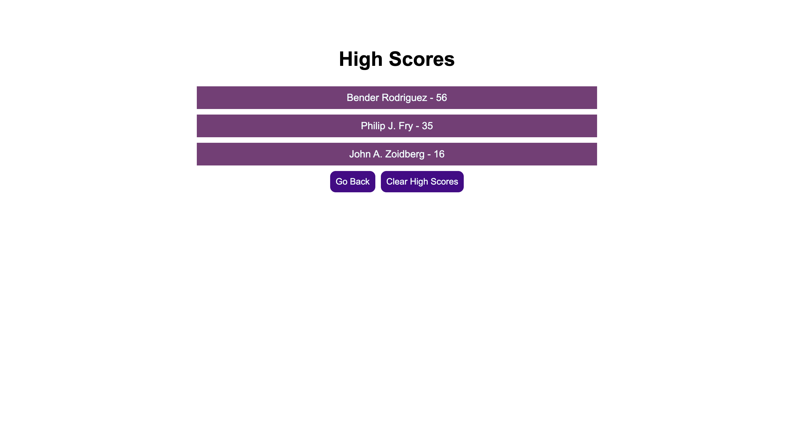
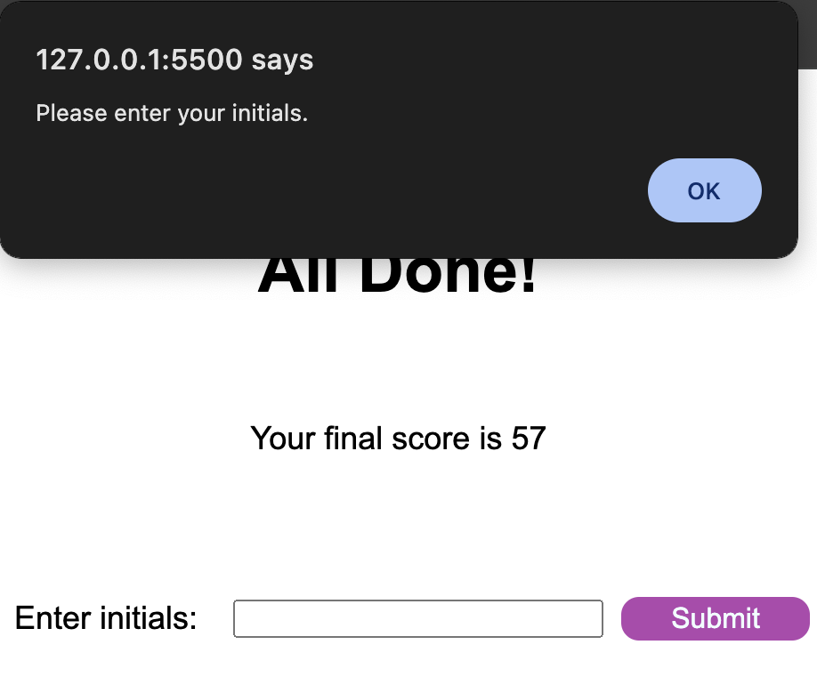
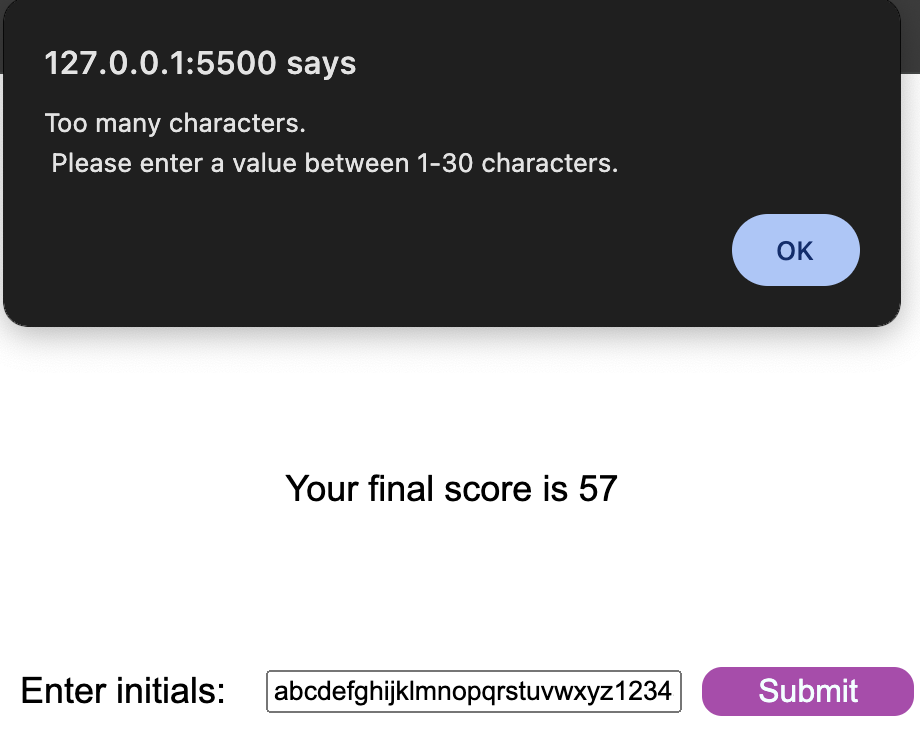
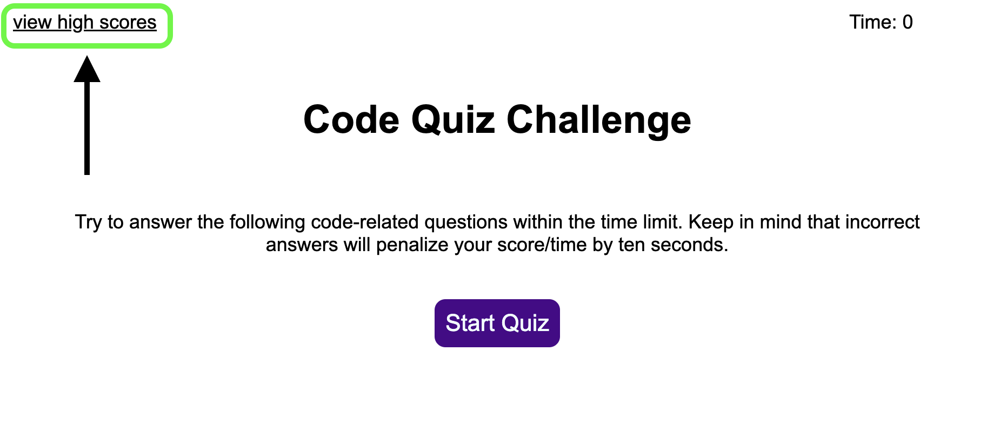

# Coding Quiz Challenge

## Description

This project was created for users who want to review coding concepts in the form of a multiple choice quiz. The quiz features a countdown timer, and will end the quiz if the time runs out. Users are able to save their scores and view a high score list. In an effort to dynamically update the code, the different "pages" are crafted using one index.html file and a javascript that uses a revolving door of child containers to achieve the different looks and displays.

## Installation

N/A

## Usage

Navigate to https://dgomie.github.io/coding-quiz/.

Click the "Start Quiz" button to start the timer and begin the quiz.

One question will display at a time as well as a list of answer choice buttons. Click on the answer button to select your choice.

Once clicked, the next question and answer set will display as well as a feedback prompt for the previous question notifying the user if the selected answer was correct or wrong. If the answer was wrong, ten seconds are deducted from the countdown timer.

The quiz ends when there is either no more questions left or when the timer reaches zero. Score is determined by the amount of time on the timer, and can be a negative number. Once the quiz is over the user's final score will display along with an initials submission form to submit the user's name to the high score list.

The submission form accepts values between 1-30 characters and will alert the user if the input is empty or too long. Once an input is accepted, it is stored in the local storage. Once the initials are submitted, the page will then display the high scores list and a "Go Back" button and "Clear High Scores" button. Clicking the "Go Back" button will reload the main quiz page. Clicking "Clear High Scores" will clear the local storage and remove the high score cards from the page.

Additionally, the high scores section can be accessed by clicking on "view high scores" on the main landing page. It functions the same as when the user accesses it from submitting their initials.

## Credits

Stack Overflow user [Markus R](https://stackoverflow.com/users/2428503/markus-rn): [Sorting object property by value](https://stackoverflow.com/questions/1069666/sorting-object-property-by-values)

MDN Web Docs: [Storage: key() method](https://developer.mozilla.org/en-US/docs/Web/API/Storage/key)

## License

Please refer to the LICENSE in the repo.
